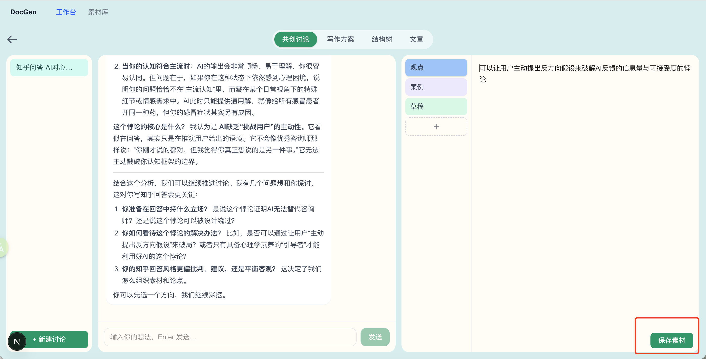
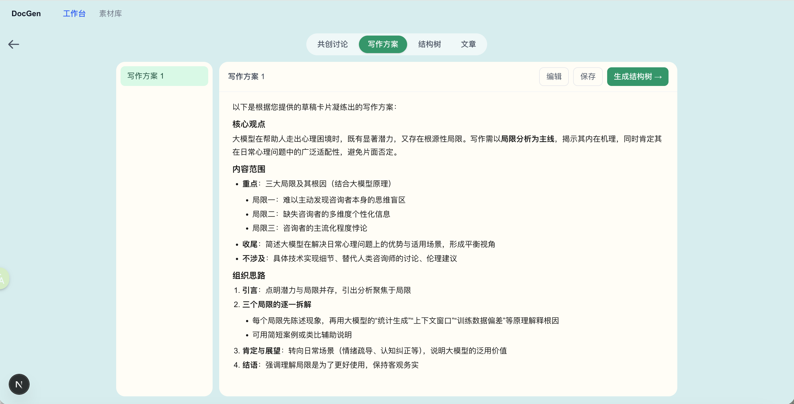
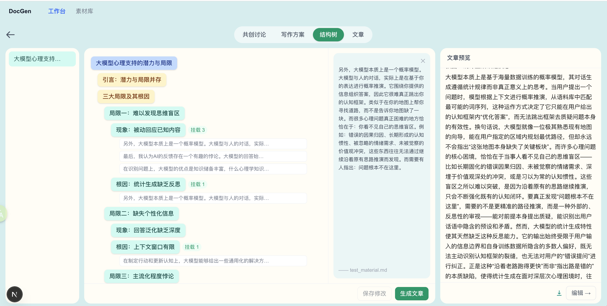
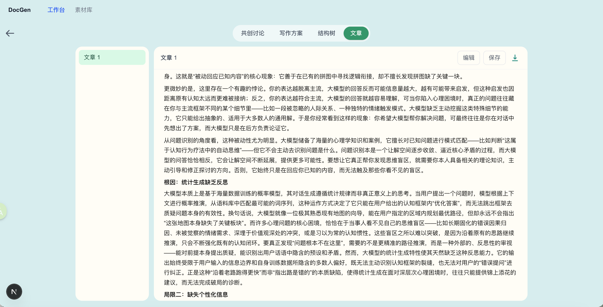

# CoSpace

一个面向「素材 → 思路 → 成稿」的 AI 共创写作工具。围绕你自己的素材库，与 AI 讨论并沉淀观点，自动生成写作方案、可编辑的文章结构树（并把素材片段精准挂载到各节点），最终一键成稿。

> 后端可在**不配置任何大模型 API Key** 的情况下运行：自动降级到本地实现（抽取式摘要 + 拼接式写作 + 哈希向量），开箱即跑、便于体验与开发。

---

## ✨ 功能特性

- **素材库**：上传文档，自动解析、切块、摘要、向量化入库。
- **AI 共创讨论**：基于主题 + 素材库摘要展开对话；讨论中沉淀「观点 / 案例 / 草稿」三类便签，可把观点/案例反哺回素材库。
- **写作方案**：依据讨论便签一键生成写作方案，可多份、可编辑、可删除。
- **结构树 + 素材挂载**：由方案生成文章结构树，自动用「向量粗筛 + LLM 精挂」把素材片段挂到对应章节；支持手动增删挂载。
- **文章生成**：遍历结构树逐节撰写，生成即保存为一份文章，可编辑、下载、删除。
- **OpenAI 兼容**：支持 DeepSeek、火山方舟 Ark 等任意 OpenAI 兼容接口；未配置时本地降级。

---

## 📸 产品页面

> 以下为占位，后续补充实际截图（放到 `docs/screenshots/` 即可自动显示）。

### 共创讨论


### 写作方案


### 结构树


### 文章


---

## 🧭 核心工作流

```
素材库（上传·入库）
   │
   ▼
AI 共创讨论 ──► 草稿便签（观点 / 案例 / 草稿）
   │
   ▼
写作方案（一键生成，可多份）
   │
   ▼
结构树（自动筛选 + 挂载素材片段，可手动调整）
   │
   ▼
文章（逐节生成，可编辑 / 下载）
```

---

## 🛠 技术栈

| 层 | 技术 |
| --- | --- |
| 后端 | FastAPI、SQLAlchemy（async）、SQLite（aiosqlite）、FastAPI BackgroundTasks |
| 存储 | 本地文件系统（素材原文 / 生成文档） |
| 模型 | OpenAI 兼容 LLM（DeepSeek / Ark…），未配置时本地降级 |
| 向量 | sentence-transformers（可选）/ 哈希向量（默认降级） |
| 前端 | Next.js 16、React 19、Tailwind CSS v4、react-markdown |

---

## 🚀 快速开始

### 1. 后端

```bash
cd backend
python3.12 -m venv .venv
source .venv/bin/activate          # Windows: .venv\Scripts\activate
pip install -e .                   # 如需真实向量模型：pip install -e ".[embeddings]"

cp .env.example .env               # 可留空，留空即本地降级运行
uvicorn app.main:app --reload --port 8002
```

启动后访问 `http://localhost:8002/docs` 查看 API。

### 2. 前端

```bash
cd my-app
npm install
echo "NEXT_PUBLIC_API_URL=http://localhost:8002" > .env.local
npm run dev
```

打开 `http://localhost:3000`。

---

## ⚙️ 配置

后端配置全部可选，见 [`backend/.env.example`](backend/.env.example)。常用项：

```bash
# 大模型（OpenAI 兼容；留空 LLM_API_KEY 则本地降级）
LLM_API_KEY=sk-xxx
LLM_BASE_URL=https://api.deepseek.com
LLM_MODEL=deepseek-chat

# 向量（装了 sentence-transformers 时生效，否则哈希降级）
EMBEDDING_MODEL=BAAI/bge-small-zh-v1.5
EMBEDDING_DIM=256

# 鉴权 / 存储 / CORS
JWT_SECRET=change-me
DATABASE_URL=sqlite+aiosqlite:///./docgen.db
STORAGE_DIR=./storage
CORS_ORIGINS=["http://localhost:3000"]
```

前端仅需一个变量：`NEXT_PUBLIC_API_URL`（后端地址）。

---

## 📂 项目结构

```
.
├── backend/        FastAPI 后端
│   ├── app/
│   │   ├── api/          路由（auth / materials / projects）
│   │   ├── models/       SQLAlchemy 模型
│   │   ├── schemas/      Pydantic 模型
│   │   ├── services/     业务（chat / authoring / structure / generator / embedding…）
│   │   └── core/         配置 / DB / 存储 / 鉴权
│   ├── .env.example
│   └── smoke_test_new.py  端到端冒烟测试
├── my-app/         Next.js 前端
├── new/            产品方案（prd.md）
└── docs/screenshots/  README 截图
```

---

## ✅ 端到端冒烟测试

```bash
cd backend && source .venv/bin/activate
# 用临时库启动（不污染本地数据）
DATABASE_URL="sqlite+aiosqlite:///./test.db" STORAGE_DIR="./test_storage" LLM_API_KEY="" \
  uvicorn app.main:app --port 8003 &
python smoke_test_new.py
```

覆盖：素材入库 → 讨论 → 便签 → 素材回填 → 方案 → 结构树+自动挂载 → 文章生成。

---

## 📄 许可证

建议添加开源许可证（如 MIT）。在仓库根目录创建 `LICENSE` 文件即可。
