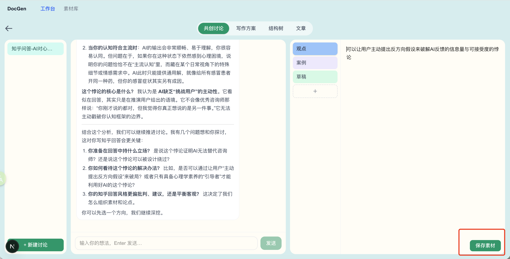
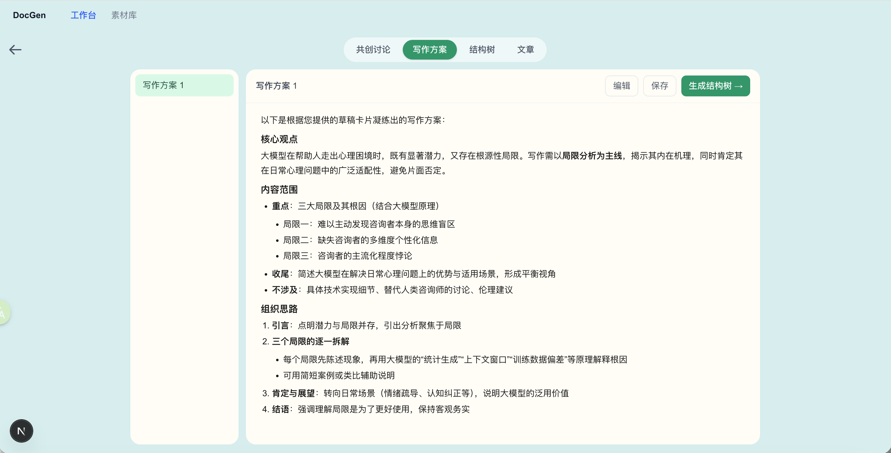
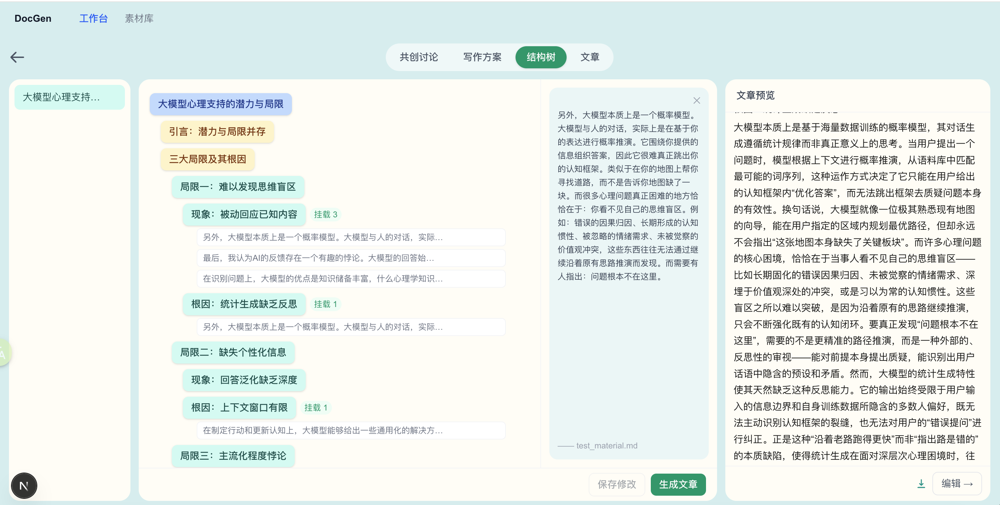
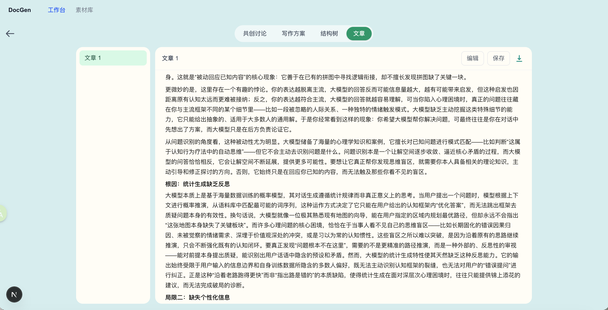

# CoSpace

> **AI 共创 · Human in the Loop 的写作工作台**

CoSpace 不是「输入主题、一键出稿」的黑盒生成器，而是一个人与 AI 共同创作的写作空间：AI 负责发散、检索、起草，人始终在回路中——在每一个环节里判断、取舍、修改、定稿。围绕你自己的素材库，与 AI 讨论并沉淀观点，逐步生成写作方案、可编辑的文章结构树（并把素材片段精准挂载到各节点），最终成稿。

---

## ✨ 功能特性

- **素材库**：上传 PDF / DOCX / TXT / MD，自动解析、按段落切块、生成摘要、向量化入库；每个片段由模型打上**类型标签**（观点 / 论证 / 案例 / 其他），便于后续按类型取用。

- **AI 共创讨论**：基于「主题 + 素材库摘要」展开多轮对话，AI 抛角度、追问、启发思路；讨论中由你把有价值的内容沉淀为**便签**（观点 / 案例 / 方案三类），便签还可反哺回素材库循环利用。

- **写作方案**：依据你确认的「方案」便签一键凝练成写作方案，可生成多份对比、自由编辑、删除后重来。

- **结构树 + 素材挂载**：由方案生成文章结构树，自动用「向量粗筛 + LLM 精挂」把素材片段挂到对应章节；章节可自由增删改名，每个节点挂载的素材也能手动调整。

- **文章生成**：遍历结构树逐节撰写，可对**单个节点单独重新生成**；全文末尾再做一次「只加衔接、不改内容」的连贯性润色。成稿可编辑、下载，并保留多个版本。

- **风格改写**：给一篇参考范文，按其风格重写整篇文章，保留原有事实与结构；支持轻度 / 重度两档改写强度。

> 核心原则：**AI 提效，人定调**。所有中间产物（便签 / 方案 / 结构树 / 文章）都可命名、编辑、删除、留存多份，决策权始终在创作者手里。

---

## 📸 产品页面

### 共创讨论



### 写作方案



### 结构树



### 文章



---

## 🚀 快速开始

### 1. 后端

```bash
cd backend
python3.12 -m venv .venv
source .venv/bin/activate          # Windows: .venv\Scripts\activate
pip install -e .                   # 如需真实向量模型：pip install -e ".[embeddings]"

cp .env.example .env               # 按需填写，见下方「配置」
uvicorn app.main:app --reload --port 8002
```

启动后访问 `http://localhost:8002/docs` 查看 API，`http://localhost:8002/health` 可确认当前的模型与向量后端。

### 2. 前端

```bash
cd my-app
npm install
echo "NEXT_PUBLIC_API_URL=http://localhost:8002" > .env.local
npm run dev
```

打开 `http://localhost:3000` 开始使用。

### 3. 配置

后端配置项全部可选，详见 [backend/.env.example](backend/.env.example)。常用的几项：

```bash
# 大模型（OpenAI 兼容接口，如 DeepSeek、火山方舟 Ark）
LLM_API_KEY=sk-xxx
LLM_BASE_URL=https://api.deepseek.com
LLM_MODEL=deepseek-chat

# 向量（装了 sentence-transformers 时生效）
EMBEDDING_MODEL=BAAI/bge-small-zh-v1.5
EMBEDDING_DIM=256

# 鉴权 / 存储 / CORS
JWT_SECRET=change-me
DATABASE_URL=sqlite+aiosqlite:///./docgen.db
STORAGE_DIR=./storage
CORS_ORIGINS=["http://localhost:3000"]
```

前端仅需一个变量：`NEXT_PUBLIC_API_URL`（后端地址）。
